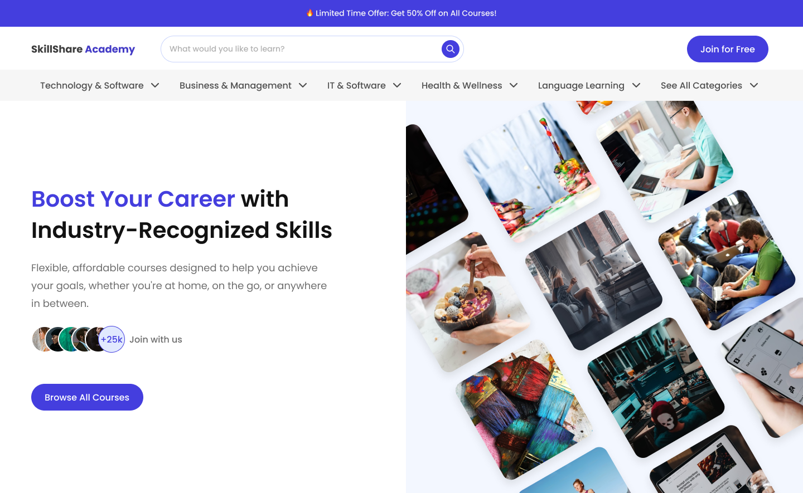

# SkillShare Academy - a community-based digital learning platform

**WorldSkills Düsseldorf 2027 Hungarian National Competition, Web Technologies - Round 1**

Submitted by: [Skills IT](https://skillsit.hu)

You've been working as a **freelance web developer**, but now you're aiming to secure a developer position at a promising new startup: **SkillShare Academy**. To evaluate your skills, the company's management has asked you to develop a **prototype** for their innovative service as part of the hiring process.

In this round, your task is to create a visually compelling and engaging **website** that highlights SkillShare Academy as a cutting-edge platform.

You will leverage your **HTML and CSS** expertise to craft a website that is visually appealing, meets accessibility standards, and implements SEO best practices. Additionally, you'll demonstrate your proficiency with **JavaScript libraries** like React, Vue or Angular by creating an advanced gantt chart that visualizes multiple lessons in a comprehensible way.

**The development process is divided into two phases:**

- **Phase 1:** You will create the website using only **vanilla HTML and CSS**. All related work files should be placed in the `phase-1` folder.
- **Phase 2:** You will develop the project using a **JavaScript framework** such as React, Vue, or Angular. Organize your source files in the `phase-2-src` folder, and place the built project in the `phase-2` folder for deployment purposes.

Every needed media, icons and text have been provided for you in the [`media`](./media) folder. You are free to use these. **You should not use any other media files** _(e.g. downloaded videos, images, icons, etc.)_.

---

- [SkillShare Academy - a community-based digital learning platform](#skillshare-academy---a-community-based-digital-learning-platform)
- [1 Landing Website (Phase 1)](#1-landing-website-phase-1)
  - [1.1 Design](#11-design)
    - [1.1.1 Custom font](#111-custom-font)
  - [1.2 Sections](#12-sections)
    - [1.2.1 Header, navigation, hero](#121-header-navigation-hero)
      - [1.2.1.1 Discount](#1211-discount)
      - [1.2.1.2 Header](#1212-header)
      - [1.2.1.3 Categories](#1213-categories)
      - [1.2.1.4 Hero Section](#1214-hero-section)
    - [1.2.2 Trusted By](#122-trusted-by)
- [2 Gantt Chart (Phase 2)](#2-gantt-chart-phase-2)

---

# 1 Landing Website (Phase 1)

**SkillShare Academy** envisions a visually stunning showcase website that captures the essence of their platform, enticing users to explore their modern experience. The website structure, detailed pages, and section requirements are outlined below.

For this phase, you are limited to using **vanilla HTML and CSS only. JavaScript is not allowed.**

## 1.1 Design

The graphic designer has **prepared the landing page design** for both desktop and mobile. Your task is to implement this design with **pixel-perfect precision**. The design assets are provided in the [`media/phase-1/design`](./media/phase-1/design) folder.

### 1.1.1 Custom font

The 'Poppins' custom font should be used throughout the website. Please make sure that the font is displayed correctly, even if **the user does not have it installed on their system**. You may download the necessary font files from the internet.

## 1.2 Sections

### 1.2.1 Header, navigation, hero

#### 1.2.1.1 Discount

At the top of the site, a sripe is visible, reminding the users about the discount.

#### 1.2.1.2 Header

- On the header, a few basic information are visible: logo, search bar, join button.
- When the search bar is active, its border should change to the primary purple.
- On mobile, only the logo and the CTA button is visible.

#### 1.2.1.3 Categories

- Below the header, there is a line displaying the featured categories
- One category should act as a link, which currently do not point to anywhere
- On mobile, the categories are displayed in one line, and it is possible to view them by scrolling left to right. On the very right side, there is a small grey overlay, indicating that it is possible to scroll.

#### 1.2.1.4 Hero Section

- The hero secetion displays multiple information. However, on mobile, the hero image is not visible.
- The CTA button should point to your solution of Phase 2
- The "Join with us" part displays some avatars, which are overlapping by default. This acts as a link, pointing to nothing. But on hover, the avatars should 'unfold', making every avatar visible one-by-one, without overlapping. This should happen with a smooth transition.

### 1.2.2 Trusted By

- This section displays some companies in a list.
- On mobile, they are still displayed as a line, and scrolling left and right is possible.

---

# 2 Gantt Chart (Phase 2)
